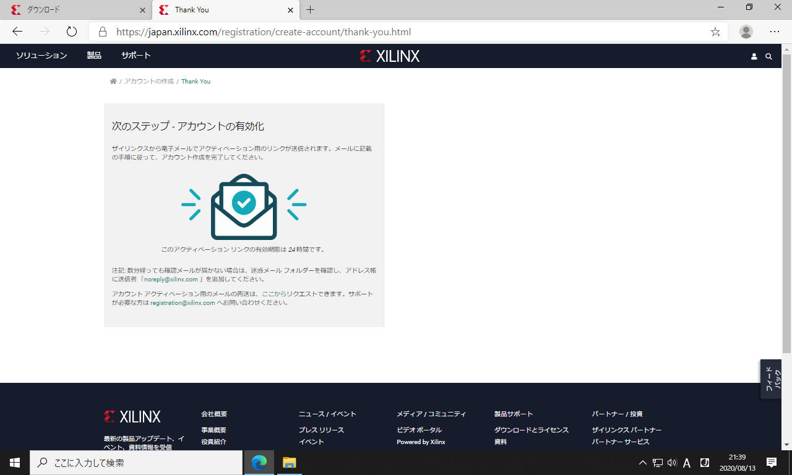
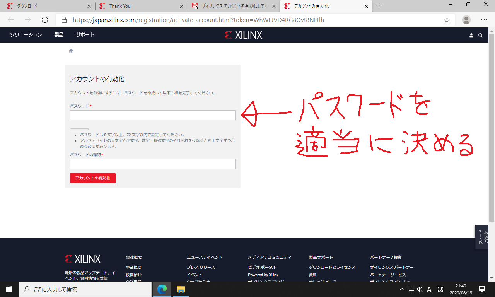
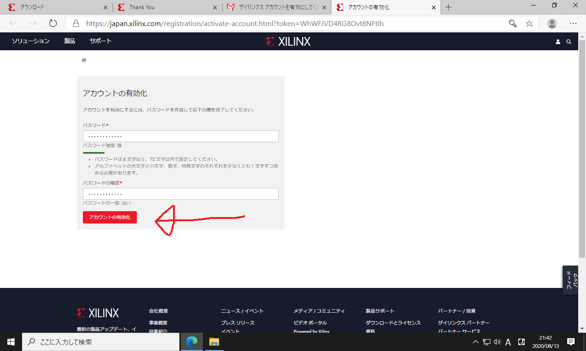
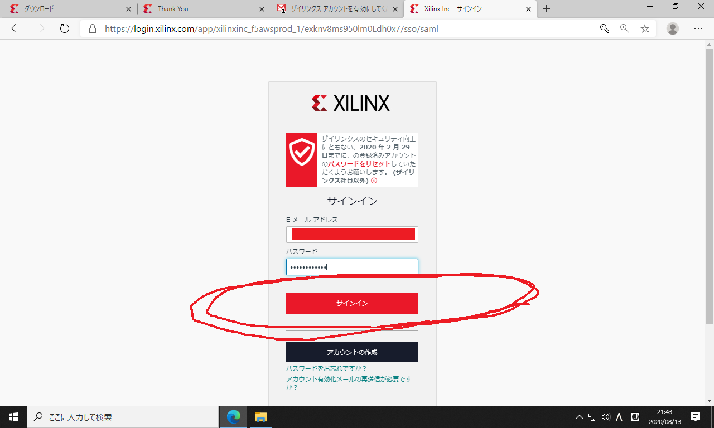
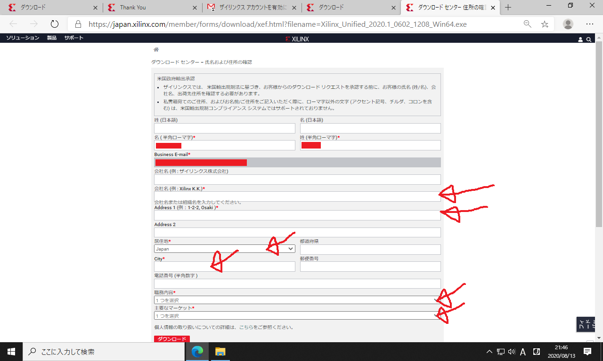

# Vitis2020のインストール方法

このページではFPGA統合開発環境**Vitis**のインストール手順を説明します。
目標は、Xilinx (AMD)社のFPGA評価ボード `Arty-S7-50` の開発環境を整えることです。
実際に必要なのは、Vitisに含まれるVivadoというソフトです。
また対象OSはWindows10以降を想定しています。

Vitisはサイズの大きなソフトなので

1. まずウェブインストーラーをダウンロードする
2. それを使ってVitisの本体をウェブからインストールする

という手順を踏みます。

### Xilinxアカウントの登録

ダウンロードにはXilinxへのアカウント登録が必要です。
以下のURLを開いて下さい。

<https://japan.xilinx.com/registration/create-account.html>

個人情報について聞かれるので入力します。
重要なのはメールアドレスで、これがアカウント名になります。

01  

送信を押します。

02  

以下の画面に遷移すれば仮登録完了です。

03  

登録したメールアドレスに確認メールが送信されるので、メーラーを開いて「アカウントを有効にする」の部分をクリックします。

04  

以下のページが開きます。
ここでXilinxアカウント用のパスワードを好みの文字列に設定します。
このパスワードは後で使用します。

05  

以下のように「アカウントを有効化」のボタンを押します。
これでアカウントの本登録が完了します。

06  

以下の画面が表示されれば、アカウント登録成功です。
サインインのボタンをクリックして下さい。

07  

さっき登録したメールアドレスとパスワードを入力します。

08  

以下のサインインのボタンをクリックします。

09  

以下の画面が表示されれば、サインイン完了です。

10  

これでXilinx社の統合開発環境 (Vivado) がダウンロードできるようになりました。

### 統合開発環境(Vivado)のダウンロード

次のURLを開いて下さい。

<https://japan.xilinx.com/support/download.html>

ページをスクロールして、以下の「ザイリンクス統合インストーラー Windows用自己解凍型ウェブインストーラー」をクリックして下さい。

11  

個人情報について聞かれるので入力します。
赤印の箇所だけ入力すればOKです。
名前とメールアドレスは、さっきアカウントを作ったときに登録したものを使用します。

12  

入力を終えたら下部の「ダウンロード」をクリックします。
これでダウンロードが始まります。

13  

以下のようなウェブインストーラーがダウンロードされます。

14  

### Vitis2020のインストール

インストーラーのダウンロードが完了したら、クリックして開きます。

15  

以下の画面が開くので、`Next`をクリックします。

16  

以下のアカウント認証画面が開きます。
`User ID` は Xilinx アカウント作成時に登録したメールアドレスです。
`Password` も Xilinx アカウント作成時に登録したものを入力します。

17  

入力を終えたら`Next`をクリックします。

18  

以下のライセンスの同意確認画面が開きます。
以下の3箇所が空白になっているので、チェックします。

19  

チェックしたら`Next`をクリックします。

20  

以下のインストール内容の選択画面が開きます。
デフォルト値 (`Vitis`) のままでOKです。
本当に欲しいものは2番目の`Vivado`なのですが、`Vitis`の中に含まれています。

21  

以下のダウンロード内容の選択画面が開きます。

* ハードディスクの容量が余っている場合は、デフォルトの設定値のままでもOKです。その場合のダウンロードサイズは30GB、インストールサイズは110GBになります。
* ダウンロードサイズを減らす場合は、`Devices` の中から不要なチェックを外します。 `7 Series` だけを残して下さい。

22  

以下の設定前千名歴、ダウンロードサイズが14GB、インストールサイズが67GBに減ります。
これで`Next`をクリックします。

これでもサイズが大きすぎる場合は、右下の`Back`のボタンを押して、`Select Product to Install`のページに戻って下さい。
そして`Vivado`を選択し、次のページで`Vivado HL WebPACK`を選択し、その次のページで`Devices`内を`7 Series`だけにして下さい。
これでダウンロードサイズが10GB、インストールサイズが35GB程度まで削減できます。

23  

Vivadoのインストール場所と、使用できるユーザーを設定します。
ここはデフォルトの設定のまま Next を押してOKです。

24  

ディレクトリの作成確認に`Yes`と答えます。

25  

以下の最終確認画面が開きます。
サイズが大きいので、パソコンの記憶容量を確認してディスクがあふれないことを確かめて下さい。
ここで`Install`をクリックすると、統合開発環境本体のダウンロードが始まります。

26  

ダウンロードとインストールが始まります。
しばらく待ちます。

27  

インストールが完了すると、デスクトップに以下のショートカットが生成されます。

28  

このうち使用するのは黄色のアイコン (`Vivado`) だけです。
起動できるかどうか、一応確かめて下さい。
なお起動時に「Could not locate Quick Help files. Quick Help will not be available.」という警告が出ることがありますが、実害はありません。

起動が確認できたら終了してOKです。
