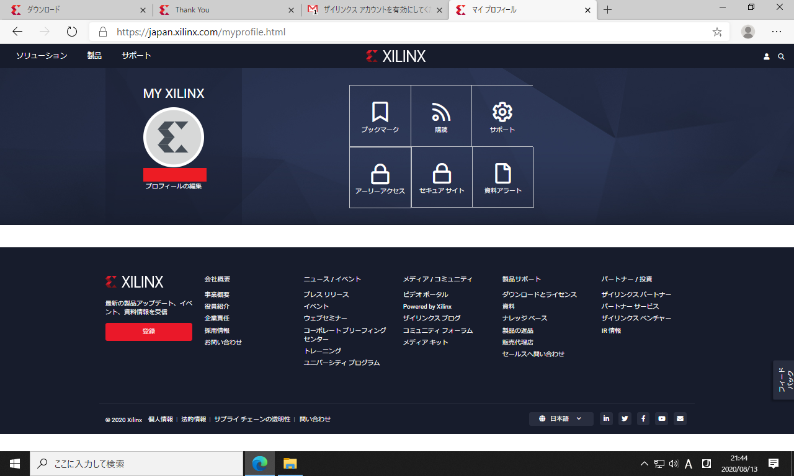
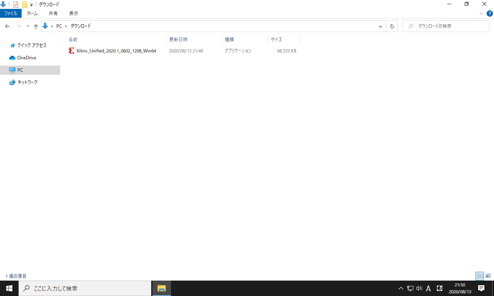

# Vitis2021 (Vivado2021) のインストール方法

このページではFPGA統合開発環境**Vitis**のインストール手順を説明します。
目標は Xilinx(AMD) 社のFPGA評価ボード `Arty-S7-50` の開発環境を整えることです。
実際に必要なのは、Vitisに含まれるVivadoというソフトです。
また対象OSはWindows10以降を想定しています。

Vitisはサイズの大きなソフトなので

1. まずウェブインストーラーをダウンロードする
2. それを使ってVitisの本体をウェブからインストールする

という手順を踏みます。

### Xilinxアカウントの登録

ダウンロードにはXilinxへのアカウント登録が必要です。
以下のURLを開いて下さい。

<https://japan.xilinx.com/registration/create-account.html>

個人情報について聞かれるので入力します。
重要なのはメールアドレスで、これがアカウント名になります。

01  

送信を押します。

02  

以下の画面に遷移すれば仮登録完了です。

03  

登録したメールアドレスに確認メールが送信されるので、メーラーを開いて「アカウントを有効にする」の部分をクリックします。

04  

以下のページが開きます。
ここでXilinxアカウント用のパスワードを好みの文字列に設定します。
このパスワードは後で使用します。

05  

以下のように「アカウントを有効化」のボタンを押します。
これでアカウントの本登録が完了します。

06  

以下の画面が表示されれば、アカウント登録成功です。
サインインのボタンをクリックして下さい。

07  

さっき登録したメールアドレスとパスワードを入力します。

08  

以下のサインインのボタンをクリックします。

09  

以下の画面が表示されれば、サインイン完了です。

10  

これでXilinx社の統合開発環境 (Vivado) がダウンロードできるようになりました。

### 統合開発環境(Vivado)のダウンロード

次のURLを開いて下さい。

<https://japan.xilinx.com/support/download.html>

ページをスクロールして、以下の「ザイリンクス統合インストーラー Windows用自己解凍型ウェブインストーラー」をクリックして下さい。

11  

個人情報について聞かれるので入力します。
赤印の箇所だけ入力すればOKです。
名前とメールアドレスは、さっきアカウントを作ったときに登録したものを使用します。

12  

入力を終えたら下部の「ダウンロード」をクリックします。
これでダウンロードが始まります。

13  

以下のようなウェブインストーラーがダウンロードされます。

14  

### Vitis2021のインストール

インストーラーのダウンロードが完了したら、クリックして開きます。

16  

以下の画面が開くので、`Next`をクリックします。

17  

以下のアカウント認証画面が開きます。
`User ID` は Xilinx アカウント作成時に登録したメールアドレスです。
`Password` も Xilinx アカウント作成時に登録したものを入力します。

18  

入力を終えたら`Next`をクリックします。

19  

以下のインストール内容の選択画面が開きます。
`Vivado`を選択します。

20  

チェックしたら`Next`をクリックします。

21  

インストールするVivadoの種類が表示されるので、`Vivado ML Standard`を選択します。

22  

チェックしたら`Next`をクリックします。

23  

インストールする内容のチェックリストが表示されます。以下はデフォルトの設定です。

24  

以下のように必要な項目だけチェックを残せば、インストール容量を削減できます。
今回は`Arty-S7-50`というFPGA評価ボードを動かしたいので、`Devices`のところを`7-Series`だけ残しました。

25  

以下のライセンスの同意確認画面が開きます。
以下の2箇所が空白になっているので、チェックします。

26  

チェックしたら`Next`をクリックします。

27  

Vivadoのインストール場所と、使用できるユーザーを設定します。
ここはデフォルトの設定のまま Next を押してOKです。

28  

ディレクトリの作成確認に`Yes`と答えます。

29  

以下の最終確認画面が開きます。
サイズが大きいので、パソコンの記憶容量を確認してディスクがあふれないことを確かめて下さい。
ここで`Install`をクリックすると、統合開発環境本体のダウンロードが始まります。

30  

ダウンロードとインストールが始まります。
しばらく待ちます。

31  

インストールが完了すると、デスクトップに`Vivado`のアイコンが生成されます。
なお起動時に「Could not locate Quick Help files. Quick Help will not be available.」という警告が出ることがありますが、実害はありません。

起動が確認できたら終了してOKです。

## デバイス情報の追加

ここまでの作業でVivadoが動くようになりました。
しかしまだ、FPGA評価ボードを動かすことはできません。
ボード固有の情報(デバイス情報)がVivadoに入っていないからです。

以下ではDigilent社製のFPGA評価ボード (ARTY-S7-50など) のデバイス情報を追加する方法について説明します。
まず下記のリンクをクリックして `vivado-board-master.zip` というファイルをダウンロードして下さい。

<https://github.com/Digilent/vivado-boards/archive/master.zip>

ZIP解凍すると`vivado-board-master`というファイルが得られます。
この中の`new`フォルダ内の`board_files`というフォルダに、Digilent社製ボードのデバイス情報ファイルが入っています。

次に `C:\Xilinx\Vivado\2021.1\data\boards\board_files` のフォルダを開きます。
ここにデバイス情報ファイルを入れると、Vivadoに読み込まれます。

これら2つのフォルダを開くと以下のようになります。

28  

以下のようにデバイス情報ファイルを移動して下さい。

29  

以上の作業でFPGA評価ボードの開発環境が整いました。
インストール作業は完了です。
お疲れ様でした。
