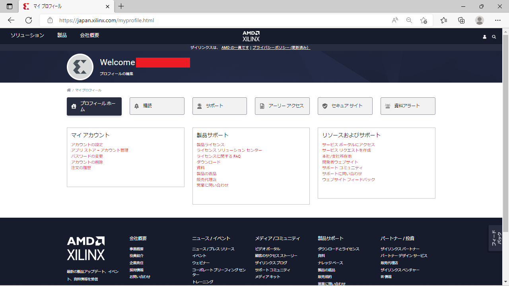
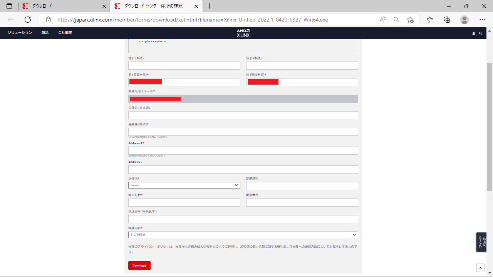

# Vitis2022のインストール方法

このページではFPGA統合開発環境**Vitis**のインストール手順を説明します。
目標は Xilinx(AMD) 社のFPGA評価ボード `Arty-S7-50` の開発環境を整えることです。
実際に必要なのは、Vitisに含まれるVivadoというソフトです。
また対象OSはWindows10以降を想定しています。

Vitisはサイズの大きなソフトなので

1. まずウェブインストーラーをダウンロードする
2. それを使ってVitisの本体をウェブからインストールする

という手順を踏みます。

### Xilinxアカウントの登録

ダウンロードにはXilinxへのアカウント登録が必要です。
以下のURLを開いて下さい。

<https://japan.xilinx.com/registration/create-account.html>

個人情報について聞かれるので入力します。
重要なのはメールアドレスで、これがアカウント名になります。

01  

以下の送信ボタンを押します。

02  

以下のページが開きます。
アクセストークンは登録したメールアドレスに送信されます。
パスワードは適当な文字列に設定します。
このパスワードは後で使用します。

03  

以下の「アカウントを有効化」のボタンを押します。
これでアカウントの本登録が完了します。

04  

以下の画面が表示されれば、アカウント登録成功です。
サインインのボタンをクリックして下さい。

05  

さっき登録したメールアドレスとパスワードを入力します。

06  

以下のサインインのボタンをクリックします。

07  

以下の画面が表示されれば、サインイン完了です。

08  

これでXilinx社の統合開発環境 (Vivado) がダウンロードできるようになりました。

### 統合開発環境(Vivado)のダウンロード

次のURLを開いて下さい。

<https://japan.xilinx.com/support/download.html>

ページをスクロールして、以下の「ザイリンクス統合インストーラー Windows用自己解凍型ウェブインストーラー」をクリックして下さい。

09  

個人情報について聞かれるので入力します。
赤印の箇所だけ入力すればOKです。
名前とメールアドレスは、さっきアカウントを作ったときに登録したものを使用します。

10  

入力を終えたら下部の「ダウンロード」をクリックします。
これでダウンロードが始まります。

11  

以下のようなウェブインストーラーがダウンロードされます。

12  

### Vitis2021のインストール

インストーラーのダウンロードが完了したら、クリックして開きます。

13  

以下の画面が開くので、`Next`をクリックします。

14  

以下のアカウント認証画面が開きます。
`User ID` は Xilinx アカウント作成時に登録したメールアドレスです。
`Password` も Xilinx アカウント作成時に登録したものを入力します。

15  

入力を終えたら`Next`をクリックします。

16  

以下のインストール内容の選択画面が開きます。
`Vitis`が選択されていることを確認し、`Next`をクリックします。

17  

インストールする内容のチェックリストが表示されます。以下はデフォルトの設定です。

18  

以下のように必要な項目だけチェックを残せば、インストール容量を削減できます。
今回は`Arty-S7-50`というFPGA評価ボードを動かしたいので、`Devices`のところを`7-Series`だけ残しました。

19  

以下のライセンスの同意確認画面が開きます。
以下の6箇所が空白になっているので、チェックします。

20  

チェックしたら`Next`をクリックします。

21  

Vivadoのインストール場所と、使用できるユーザーを設定します。
ここはデフォルトの設定のまま Next を押してOKです。

22  

ディレクトリの作成確認に`Yes`と答えます。

23  

以下の最終確認画面が開きます。
サイズが大きいので、パソコンの記憶容量を確認してディスクがあふれないことを確かめて下さい。
ここで`Install`をクリックすると、統合開発環境本体のダウンロードが始まります。

24  

ダウンロードとインストールが始まります。
しばらく待ちます。

25  

インストールが完了すると、デスクトップに`Vivado`のアイコンが生成されます。

26  

黄色の`Vivado`のアイコンをクリックして起動し、以下のソフトが立ち上がれば、インストール成功です。

27  

これでVItis (Vivado)のインストールは完了です。
お疲れ様でした。
